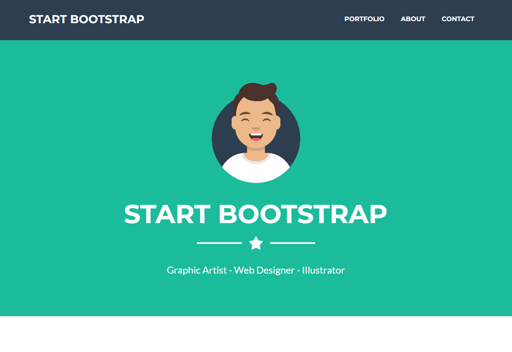

# Not-Bootstrap-Only-CSS
Bu proje, yalnızca CSS kullanarak tasarlanmış bir web sayfasını içerir. HTML ve CSS becerilerimi geliştirmek ve modern bir web sitesinin nasıl oluşturulabileceğini öğrenmek için oluşturulmuştur.

## Kullanılan Teknolojiler

- HTML
- CSS
- Font Awesome 
- Google Fonts (Montserrat ve Lato)
